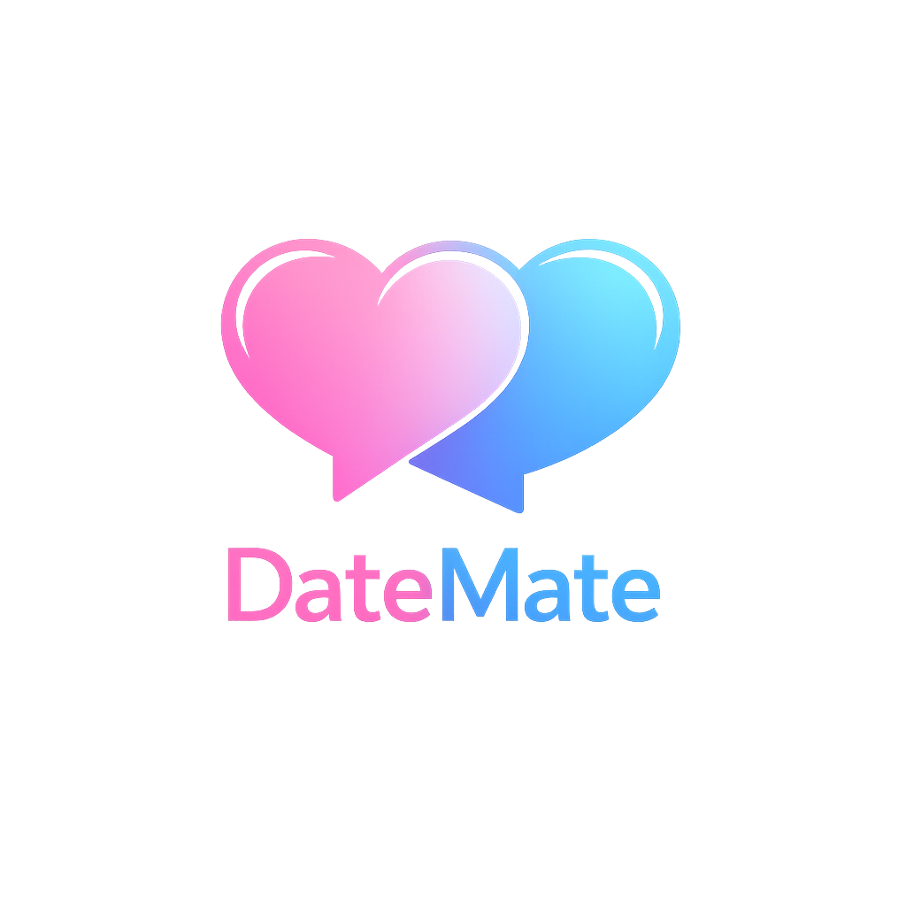
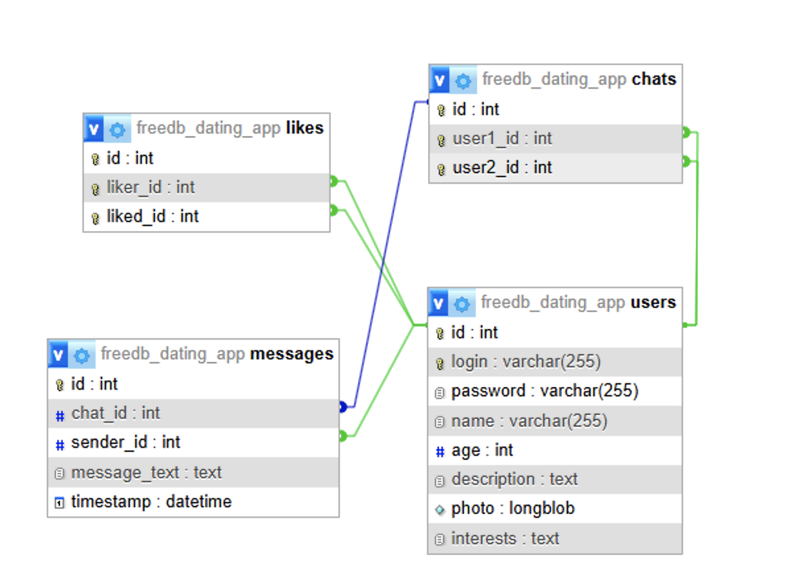
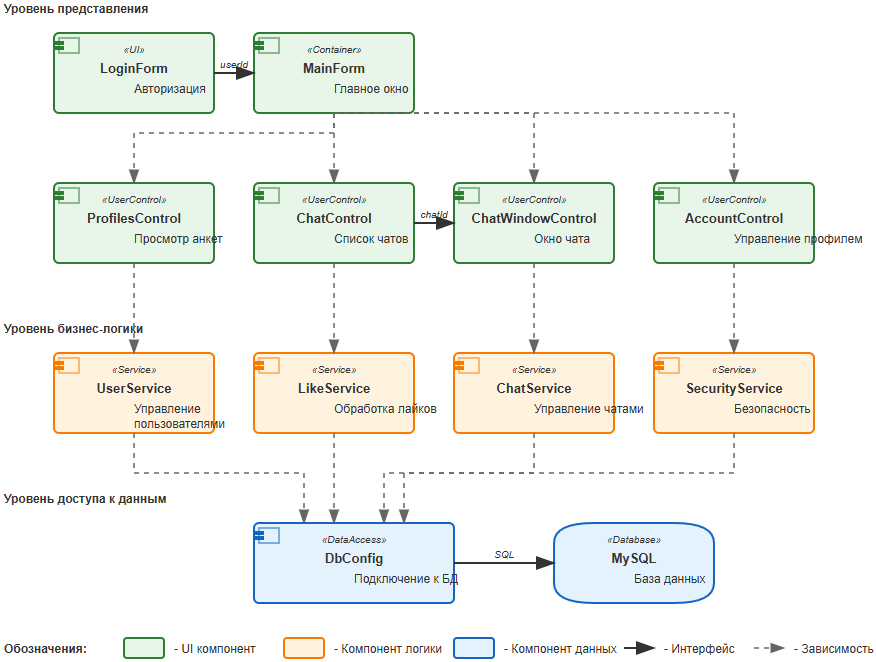
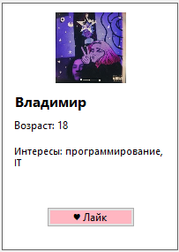
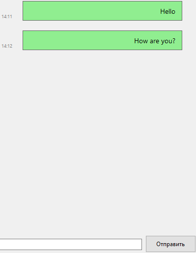
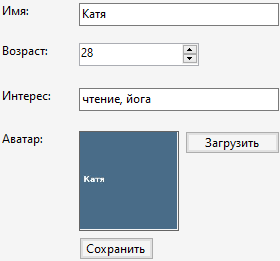

# 💖 Dating App — Desktop Matchmaking System

<p align="center">
  
</p>

[](https://learn.microsoft.com/dotnet/csharp/) [](https://dotnet.microsoft.com/) [](https://learn.microsoft.com/dotnet/desktop/winforms/) [](https://www.mysql.com/)

> Профессиональная настольная система знакомств на C# (Windows Forms) с базой данных MySQL,
> реализующая систему анкет, лайков, взаимных симпатий и чата.

---

## 🚀 Технологический стек

| Компонент | Технология |
|-----------|------------|
| Backend | C# (.NET 6) |
| UI | Windows Forms |
| Database | MySQL 8 |
| Data Access | ADO.NET |
| Security | SHA-256 + Salt |
| Architecture | Layered Architecture |

---

## 📦 Структура проекта

```
📁 database
   └── SQL scripts

📁 docs
   ├── logo.png
   ├── app-scheme.png
   ├── database-diagram.png
   ├── idef 0.png
   ├── idef 3.png
   ├── technical-specification.md
   ├── ui-scheme.png
   └── screenshots/
         ├── account-tab.png
         ├── chat-window.png
         ├── login-form.png
         └── profiles-tab.png

📁 src
   └── Source Code
```

---

## 💡 О проекте

Dating App — это курсовой проект, разработанный как полнофункциональная система
для автоматизации подбора кандидатов в службе знакомств.

Проект демонстрирует:

✔ Проектирование архитектуры  
✔ Проектирование базы данных  
✔ Разработку desktop-интерфейса  
✔ Реализацию бизнес-логики  
✔ Обработку реального взаимодействия пользователей  

---
## 🏗 Архитектурные схемы

### 🔷 IDEF0 — Общая функциональная модель

<p align="center">
  
</p>

Описывает основные процессы системы:
- Регистрация  
- Авторизация  
- Управление анкетами  
- Чат  
- Работа с базой данных  

---

### 🔷 IDEF3 — Модель бизнес-процессов

<p align="center">
  
</p>

Детализирует последовательность действий пользователя
от запуска приложения до взаимодействия с другими анкетами.

---

### 🔷 Схема базы данных (ER-модель)

<p align="center">
  
</p>

Таблицы:

- users — пользователи  
- likes — симпатии  
- chats — диалоги  
- messages — сообщения  

База данных нормализована и поддерживает каскадное удаление.

---

### 🔷 Схема интерфейса

<p align="center">
  
</p>

Показывает структуру навигации между:
- Анкеты  
- Чат  
- Аккаунт  

---

## 🖥 Интерфейс приложения (Скриншоты)

### 🔐 Авторизация

<p align="center">
  
</p>

---

### 👥 Раздел Анкеты

<p align="center">
    
</p>

Функции:
- Просмотр пользователей  
- Лайки  
- Добавление в избранное  

---

### 💬 Чат

<p align="center">
  
</p>

Особенности:
- Отправка по Enter  
- Разделение входящих и исходящих  
- Автоскролл  
- Отображение времени  

---

### 👤 Аккаунт

<p align="center">
  
</p>

Позволяет:
- Редактировать профиль  
- Загружать фото  
- Менять данные  

---

## 🔐 Безопасность

✔ SHA-256 + соль  
✔ Параметризованные SQL-запросы  
✔ Валидация данных  
✔ Контроль доступа  
✔ Логирование  

---

## 🚀 Установка и запуск

### Требования

- Windows 10/11  
- .NET 6+  
- MySQL 8  

---

### Настройка БД

```sql
@CREATE DATABASE dating_app
@CHARACTER SET utf8mb4
@COLLATE utf8mb4_unicode_ci;
```

Импортируйте таблицы из папки `database`.

Настройте строку подключения в `DbConfig.cs`.

---

### Запуск

Clone:
```
git clone https://github.com/cotafei/dating-app-csharp.git
```

Открыть `.sln` → Build → Run

---

## 🔮 Развитие

- 🤖 AI-подбор кандидатов  
- 🌐 Web-версия  
- 📱 Mobile-клиент  
- 🔔 Push-уведомления  
- 📊 Аналитика  
- 🔐 2FA  

---

## 📄 Лицензия

GPL-3.0 License
